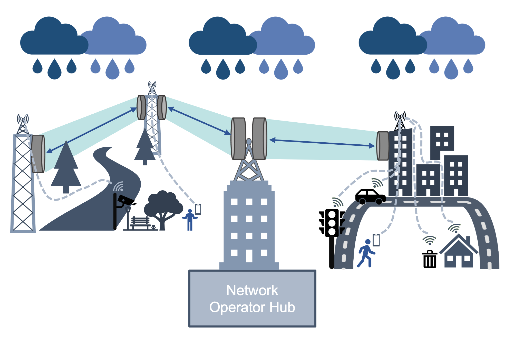

# PyNNcml
A python toolbox based on PyTorch which utilized neural network for rain estimation and classification from commercial microwave link (CMLs) data. This toolbox provides an implementation of algorithms for extracting rain-rate using neural networks and CMLs.

This project is an extended version of the [PyNNcml](https://github.com/haihabi/PyNNcml) rainfall estimation toolbox, developed as part of the M.Sc. thesis of Hai Victor Habi under the supervision of Prof. Hagit Messer at Tel Aviv University and maintained by the [Cellular Environmental Monitoring and Processing Lab](https://cellenmonlab.tau.ac.il/).  

This version includes new features and experiments as part of the M.Sc. thesis of Barak Machlev under the supervision of Dr. Jonatan Ostrometzky, which focuses on the impact of sampling interval on rainfall estimation from communication microwave links using Transformers.


* The figure above was create by Jonatan Ostrometzky.


# Getting Started
## Installation
PyNNcml is available on PyPI. To install, run the following command:
```
pip install pynncml
```

## Supported Python Versions


| Python Version | Status                                                                                                |
|----------------|-------------------------------------------------------------------------------------------------------|
| Python 3.9     |   |
| Python 3.10    |  |
| Python 3.11    |  |
| Python 3.12    |  |


# PyNNcml Features

## Task and Algorithms

1. Wet Dry Classification (RNN[1,2,3] and STD Window[6])
2. Rain Estimation (Constant Baseline [6], Dynamic Baseline [5], Direct RNN Estimation [4,3])
3. Rain Field Generation (RainGAN )
4. Rain Field Interpolation (IDW, GMZ [9])
5. Wet Dry Classification and Rain Rate Estimation (Encoder-only Transformer)


## Datasets
This repository uses the PyTorch version of the OpenMRG dataset [10] and the synthesized datasets generated as part of Barak Machlev’s M.Sc. study, described in detail in the study and used for evaluating the impact of sampling interval on rainfall estimation.

# Impact of Sampling Interval on Rainfall Estimation from Communication Microwave Links Using Transformers

This repository includes all code required to reproduce the experiments for  
**Impact of Sampling Interval on Rainfall Estimation from Communication Microwave Links Using Transformers**.

The code and results are in  
[`impact of sampling interval on rainfall estimation from communication microwave links using Transformers`](./impact%20of%20sampling%20interval%20on%20rainfall%20estimation%20from%20communication%20microwave%20links%20using%20Transformers)  
and include:

1. **test_encoder_only_transformer.py** — train and evaluate the Transformer model.
2. **Synthetic_DataSet.py** — simulation to generate the synthesized datasets.
3. **test_Synthetic_DataDet.py** — train the Transformer on the synthesized datasets.
4. **results/** — trained models and metrics from 5-fold cross-validation.


## Model Zoo *(not relevant to this study)*
In this project we supply a set of trained networks in our [Model Zoo](https://github.com/haihabi/PyNNcml/tree/master/pynncml/model_zoo), this networks are trained on our own dataset which is not publicly available.
The model contains three types of networks: Wet-dry classification network, one-step network (rain estimation only) and two-step network (rain estimation and wet-dry classification). Moreover, we have provided all of these networks with a various number of RNN cells (1, 2, 3). From more details about network structure and results see the publication list.

# Contributing

This fork aims to stay up to date and welcomes contributions.
Open a pull request or issue, or email me at barakmachlev@gmail.com.


# References

Please cite one of following paper if you found our neural network model useful. Thanks!

[1] Habi, Hai Victor and Messer, Hagit. "Wet-Dry Classification Using LSTM and Commercial Microwave Links"


[2] Habi, Hai Victor and Messer, Hagit. "RNN MODELS FOR RAIN DETECTION"


[3] Habi, Hai Victor. "Rain Detection and Estimation Using Recurrent Neural Network and Commercial Microwave Links"


[4] Habi, Hai Victor, and Hagit Messer. "Recurrent neural network for rain estimation using commercial microwave links." IEEE Transactions on Geoscience and Remote Sensing 59.5 (2020): 3672-3681.


Also, this package contains the implementations of the following papers:

[5] J. Ostrometzky and H. Messer, “Dynamic determination of the baselinelevel in microwave links for rain monitoring from minimum attenuationvalues,”IEEE Journal of Selected Topics in Applied Earth Observationsand Remote Sensing, vol. 11, no. 1, pp. 24–33, Jan 2018.

[6] M. Schleiss and A. Berne, “Identification of dry and rainy periods using telecommunication  microwave  links,”IEEE  Geoscience  and  RemoteSensing Letters, vol. 7, no. 3, pp. 611–615, 2010

[7] Jonatan Ostrometzky, Adam Eshel, Pinhas Alpert, and Hagit Messer. Induced bias in attenuation measurements taken from commercial microwave links. In 2017 IEEE International
Conference on Acoustics, Speech and Signal Processing (ICASSP), pages 3744–3748. IEEE,2017. <br>

[8] Jonatan Ostrometzky, Roi Raich, Adam Eshel, and Hagit Messer.
Calibration of the
attenuation-rain rate power-law parameters using measurements from commercial microwave networks. In 2016 IEEE International Conference on Acoustics, Speech and Signal
Processing (ICASSP), pages 3736–3740. IEEE, 2016.

[9] Goldshtein, Oren, Hagit Messer, and Artem Zinevich. "Rain rate estimation using measurements from commercial telecommunications links." IEEE Transactions on signal processing 57.4 (2009): 1616-1625.


And include PyTorch implementation of the OpenMRG dataset:

[10] van de Beek, Remco CZ, et al. OpenMRG: Open data from Microwave links, Radar, and Gauges for rainfall quantification in Gothenburg, Sweden. No. EGU23-14295. Copernicus Meetings, 2023.


If you found one of those methods usefully please cite.
